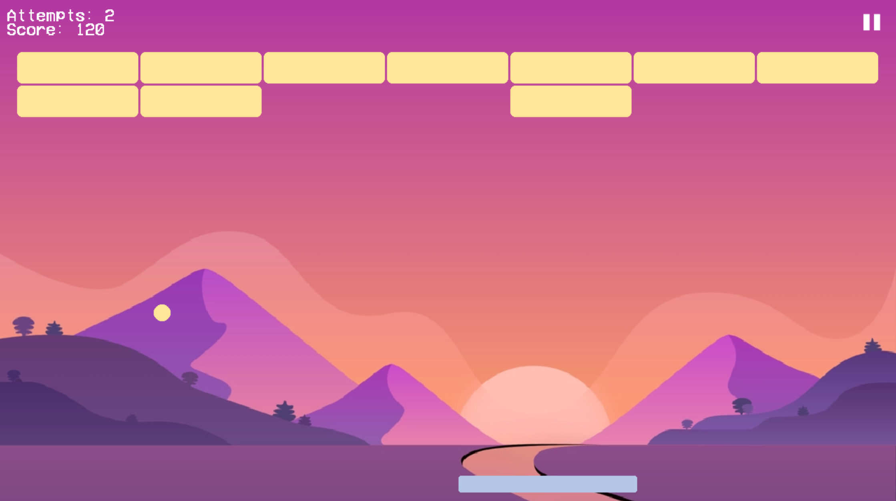

# Bài tập lớn INT2215

An attempt to recreate the classic Atari Breakout game

## Student information

- **Student name**: Đoàn Đức Kiên
- **Class:** INT2215 23
- **Group:** 2

## Screenshots



## TODO

- [x]  Classic game features (ball, paddle and collisions)
- [ ]  Game menu
- [ ]  Brick explosion on collision
- [ ]  Unlimited levels
- [ ]  Themes

## Building

### On Windows

- Install [MinGW-w64](https://www.mingw-w64.org/) on Windows (if it hasn’t been installed)
- Download the runtime binaries of [SDL2](https://www.libsdl.org/download-2.0.php), [SDL2_image](https://www.libsdl.org/projects/SDL_image) and [SDL_ttf](https://github.com/libsdl-org/SDL_ttf/releases/)
- Run the following command

```
g++ -g *.cpp -I SDL2/include -L SDL2/lib -lmingw32 -lSDL2main -lSDL2 -lSDL2_image -lSDL2_ttf -o game.exe
```

- Copy the runtime binaries to the output folder (copy `.dll` files)
- Run `game.exe`

### On MacOS

- Thanks Mr. Tuan Anh for providing the following guide.
- Install SDL2

```
brew install SDL2

brew install SDL2_image

brew install SDL2_ttf
```

- Go to [SDL2 Homepage](https://www.libsdl.org/download-2.0.php) and download SDL2-2.0.20.dmg
- Open it and copy folder SDL2.framework to `/Library/Frameworks/`
- Run `start.sh`